# Udaan CAT

> A local-first preparation command center for a CAT aspirant who has very little time, a large syllabus, and no room for unstructured effort.

## Table of Contents

- [The story behind the project](#the-story-behind-the-project)
- [Problem statement](#problem-statement)
- [Solution](#solution)
- [Goals and design principles](#goals-and-design-principles)
- [Feature overview](#feature-overview)
- [Complete user workflow](#complete-user-workflow)
- [Feature workflows](#feature-workflows)
- [Architecture](#architecture)
- [Data and scoring model](#data-and-scoring-model)
- [Local open-weight model workflow](#local-open-weight-model-workflow)
- [Technology stack](#technology-stack)
- [Getting started](#getting-started)
- [Project structure](#project-structure)
- [Persistence, privacy, and security](#persistence-privacy-and-security)
- [Current scope and limitations](#current-scope-and-limitations)
- [Future scope](#future-scope)
- [Social impact](#social-impact)
- [Contributing](#contributing)
- [License and disclaimer](#license-and-disclaimer)

## The story behind the project

One of my friends has her CAT examination in approximately 40 days. She is capable, motivated, and willing to work hard, but the countdown creates a difficult question: **what should she study today, what should she postpone, and how can she know whether her effort is actually improving her score?**

CAT preparation becomes especially stressful when the aspirant is facing all of the following at once:

- A broad syllabus across VARC, DILR, and QA.
- Uneven strengths: being comfortable in one topic can hide serious gaps in another.
- Limited time for theory, practice, revision, mocks, and analysis.
- Too many disconnected resources, spreadsheets, notebooks, and reminders.
- Anxiety after a poor mock or a few repeated mistakes.
- Difficulty converting a long-term goal such as “crack CAT” into the next 30 focused minutes.

This project started as an attempt to help her move from panic to a repeatable system. It is not a promise that a dashboard can guarantee a percentile. It is a practical study companion that makes the next action visible, records feedback, and helps an aspirant use the remaining time deliberately.

The implementation contains a **45-day roadmap** because the planning model is designed around a full preparation sprint. For a student with 40 days remaining, the roadmap can be treated as a compressed emergency plan: prioritize the diagnostic, weak-topic branches, daily drills, revision days, and mock-analysis days rather than trying to complete every suggested task at the original pace.

## Problem statement

### Human problem

A CAT aspirant with around 40 days left is worried about cracking the exam. She needs to study consistently, but she does not have a reliable way to answer four important questions:

1. **Where am I actually weak?**
2. **What should I do today instead of endlessly planning?**
3. **Did today's practice improve my skill or only consume time?**
4. **How do I turn mistakes and mock scores into tomorrow's plan?**

### Product problem

Most preparation workflows are fragmented. A student may use one resource for formulas, another for mocks, a spreadsheet for scores, a notebook for errors, and a calendar for study sessions. Fragmentation creates friction precisely when time and confidence are scarce.

The product problem is therefore:

> Build a focused, adaptive, low-friction CAT preparation workspace that converts a baseline assessment into a practical study plan, gives continuous feedback through small tests, and preserves the learner's progress locally or in the cloud.

### Success criteria

The system should help an aspirant:

- Start quickly with a profile or demo mode.
- Establish a baseline across all three CAT sections.
- See a prioritized 45-day plan instead of a blank calendar.
- Complete small daily actions without losing context.
- Track topic-level mastery and accuracy over time.
- Capture mistakes and revisit them.
- Record real mock results and compare trajectory.
- Build consistency through focused sessions.
- Continue using the core product even when cloud sync or the local model is unavailable.

## Solution

Udaan CAT combines planning, practice, measurement, and reflection in one React application:

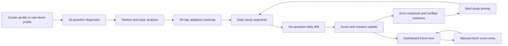

The system deliberately keeps high-stakes logic deterministic:

- Answer keys come from repository data.
- Scores and negative marking are calculated in the client application.
- Roadmap generation is rules-based.
- Mastery changes are calculated from observed practice performance.
- The local model is optional and can only provide a supplemental explanation.

This separation matters. A language model can explain a concept in a different way, but it should not silently change an answer key, rewrite a score, or decide whether a student passed a topic.

## Goals and design principles

### 1. Reduce cognitive load

The app should answer “what next?” without requiring the learner to build a planning system before studying.

### 2. Make progress measurable

Every diagnostic, daily drill, study segment, and mock entry should create useful feedback rather than simply display activity counts.

### 3. Optimize for a short runway

The design favors weak-topic prioritization, timed drills, error review, and mock analysis—the activities with the highest practical value near an exam.

### 4. Preserve agency

The learner can choose a scheduled drill, run a section sprint, select roadmap days, start Pomodoro sessions, enter mocks, and use the local coach only when useful.

### 5. Be local-first and resilient

The main dashboard works from browser state. Firebase sync is optional for authenticated users, and the local coach is an additional capability rather than a requirement.

### 6. Keep automation honest

The application distinguishes between an estimate and an official CAT result, a manual mock score and a live mock engine, a reminder preference and an actual notification, and a model-generated note and a verified solution.

## Feature overview

| Area | What it provides | Current implementation |
|---|---|---|
| Dashboard | Daily briefing, progress, plan, heatmap, consistency, mock snapshot | Implemented |
| Onboarding | Manual profile, quick local sign-in, Google sign-in, demo profiles | Implemented |
| Diagnostic | 18 static questions, section/topic analysis, estimated percentile | Implemented |
| Adaptive roadmap | 45 days across foundation, mastery, and revision phases | Implemented, rules-based |
| Daily tests | Six-question scheduled drills or section sprints | Implemented, static question bank |
| Mastery tracking | Topic score, level, accuracy, practice count, recent deltas | Implemented |
| Error notebook | Automatic entries from attempted wrong daily-test answers | Implemented |
| Syllabus tracker | Search, section filter, weightage, topic inspector | Implemented |
| Formula Vault | Formula and concept reference modal | Implemented |
| CAT calculator | On-screen arithmetic helper | Implemented |
| Mock tracker | Record external full/sectional mock scores and analysis | Implemented; not a mock engine |
| Pomodoro | Focus/break cycles, segment links, session analytics | Implemented |
| Settings | Reminder preference and copyable daily briefing | Implemented; no notification scheduler |
| Firebase sync | Authenticated profile and progress persistence | Implemented |
| Browser resilience | Local state snapshot in `localStorage` | Implemented |
| Local AI coach | Supplemental answer explanation through Ollama | Implemented, optional |

## Complete user workflow

The recommended workflow for the 40-day use case is:

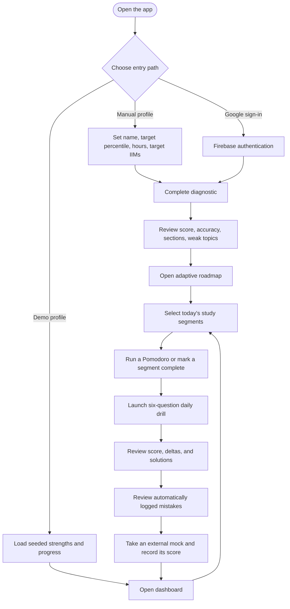

### Suggested 40-day operating rhythm

The application does not enforce this schedule automatically, but the following rhythm matches the product's strengths:

- **Day 1:** Complete the diagnostic and inspect the topic-level gaps.
- **Days 2–10:** Rebuild high-impact foundations while completing daily drills.
- **Days 11–25:** Alternate focused topic work with sectionals and error analysis.
- **Days 26–35:** Increase mock frequency, improve selection strategy, and revisit recurring errors.
- **Days 36–39:** Prioritize revision, formulas, weak sections, and selected high-yield practice.
- **Day 40:** Use a calm final review strategy; avoid introducing an entirely new syllabus.

The built-in roadmap has 45 days and can be compressed by combining lighter segments, skipping lower-priority tasks, and preserving the diagnostic, mock-analysis, revision, and error-review checkpoints.

## Feature workflows

### 1. Onboarding and profile setup

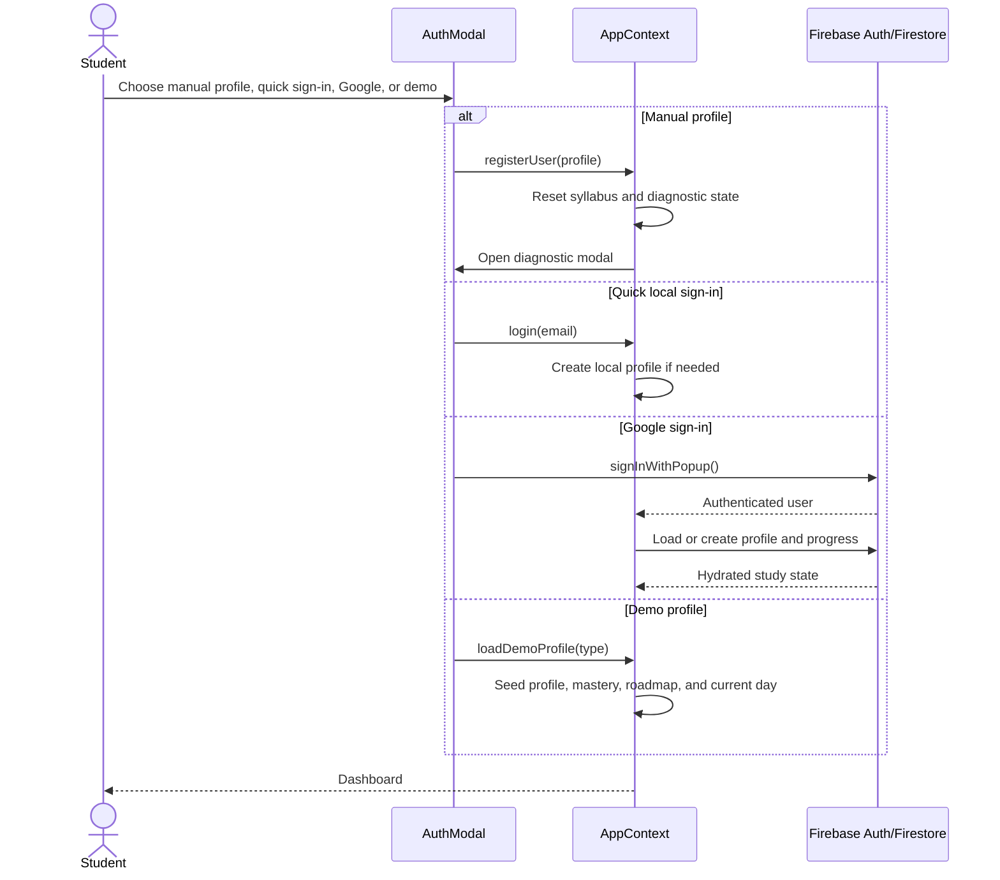

Entry paths have different guarantees:

- **Manual profile:** Creates a local profile without a password backend.
- **Quick sign-in:** Creates a local session from an email-like value; it is not account authentication.
- **Google sign-in:** Uses Firebase Auth and enables owner-scoped Firestore sync when configured.
- **Demo profiles:** Provide seeded engineer, non-engineer, and fresh-start states for exploration.

### 2. Diagnostic-to-roadmap workflow

The diagnostic is the most important first step because it turns general worry into a topic map.

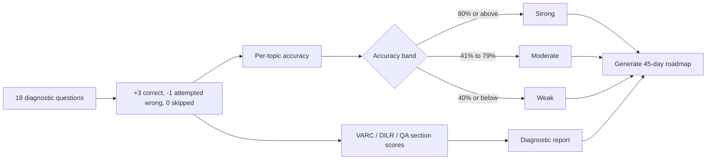

The report includes:

- Total score and maximum score.
- Overall attempted-question accuracy.
- Section scores for VARC, DILR, and QA.
- Topic evaluations and recommendations.
- Weak, moderate, and strong topic IDs.
- A fixed-threshold estimated percentile mapping.

The roadmap generator creates three broad phases:

1. **Foundation and high-weightage core.**
2. **Speed, accuracy, sectionals, and hard-question selection.**
3. **Revision, mock analysis, and final exam strategy.**

Weak-topic IDs influence selected practice targets. The current implementation is adaptive primarily to weak topics; it is not a machine-learning scheduler and does not yet fully reweight every day from both strengths and weaknesses.

### 3. Roadmap and study-segment workflow

Each roadmap day contains a title, focus section, primary topics, goals, practice target, tips, and optional scheduled test metadata.

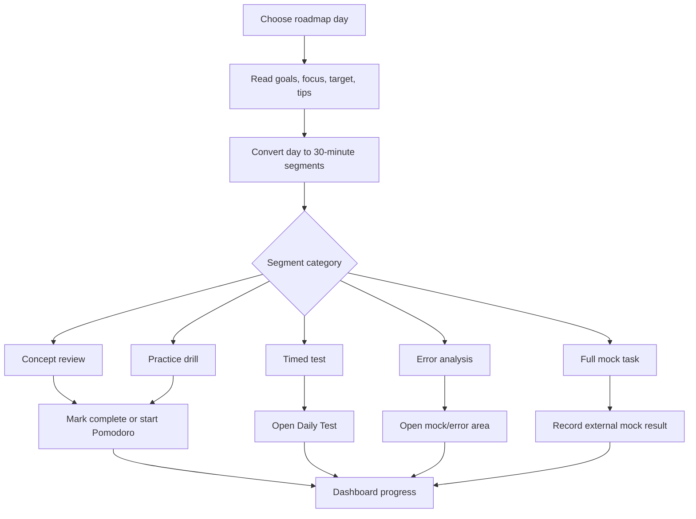

The number of segments adapts to the user's configured daily hours. A typical three-hour day is represented by six 30-minute blocks; lower-hour profiles receive fewer blocks.

### 4. Daily test workflow

Daily Test has three UI states: selection, running, and completed results.

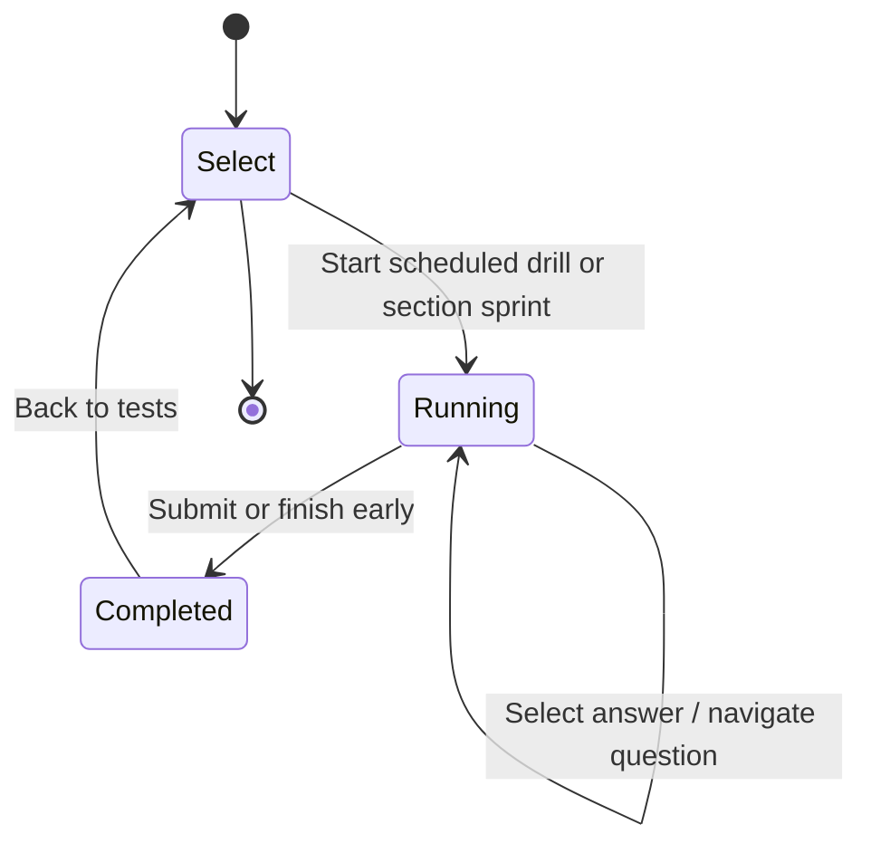

When a test starts:

1. The app combines the static daily question bank and diagnostic question bank.
2. A scheduled drill tries to filter by the current roadmap topics.
3. A section sprint filters by `ALL`, `QA`, `DILR`, or `VARC`.
4. The app shuffles the available questions and selects six.
5. The learner navigates questions and chooses indexed options.

When a test is submitted:

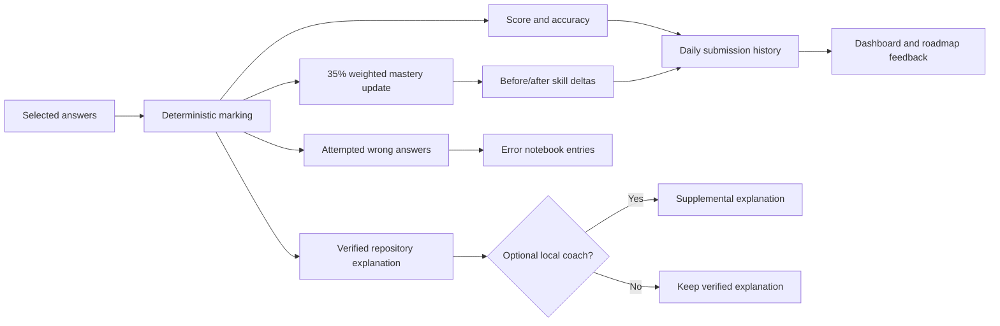

Daily-test scoring uses:

- `+3` for a correct answer.
- `-1` for an attempted incorrect answer.
- `0` for an unanswered question.
- Topic mastery update: `new = old + 0.35 × (test accuracy - old)`.
- Mastery bands: `Strong` at 70+, `Developing` at 45–69, and `Weak` below 45 for ongoing tracker updates.

The official answer and in-repository explanation remain visible even if the local model is stopped.

### 5. Syllabus tracker and mastery heatmap

The Syllabus screen provides a searchable, section-filtered inventory of CAT topics. Each topic can expose:

- Section and category.
- CAT weightage label.
- Typical question range.
- Key concepts.
- Mastery score and level.
- Questions practiced.
- Accuracy.
- Links to a daily test and the Formula Vault.

The Dashboard heatmap summarizes the same topic state using visual bands and recent daily-test changes. This helps the learner distinguish between “I studied this once” and “my recent performance supports confidence in this topic.”

### 6. Mock tracker workflow

The Mock Tracker is designed to record tests taken through an external mock provider or exam source.

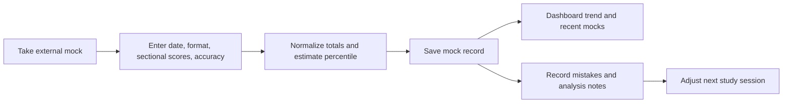

It supports full mock, VARC sectional, DILR sectional, and QA sectional records. It does **not** currently deliver a complete CAT mock exam, proctor a session, or generate questions from the roadmap.

### 7. Error notebook workflow

Attempted wrong answers in daily tests are automatically added to the error log with:

- Date.
- Question text excerpt.
- Topic and section.
- A default error category.
- A truncated correct approach.
- A reviewed/unreviewed state.

The notebook is intended to turn mistakes into revision material. In the current interface, the most visible preview appears in the Mock Tracker area, while future work can promote it into a dedicated error-analysis screen.

### 8. Pomodoro and consistency workflow

The Pomodoro tool connects planned segments to actual focus time:

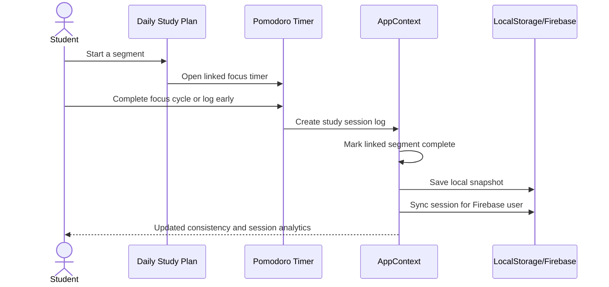

Available behaviors include:

- 25- or 30-minute focus cycles.
- Short and long breaks.
- Long-break transition after four cycles.
- Topic and section association.
- Early focus logging.
- A floating timer pill while the modal is closed.
- Analytics by total time, day, section, topic, and recent sessions.

The consistency calendar displays roadmap completion and a 45-day view. It is a visual accountability tool; it is not a background scheduler.

### 9. Formula Vault, calculator, and settings workflow

The global footer and navigation expose lightweight tools that reduce context switching:

- **Formula Vault:** Review stored formulas and concept reminders.
- **Virtual CAT calculator:** Perform arithmetic while working through practice.
- **Settings:** Configure a reminder preference/time label and generate a copyable daily briefing.
- **Daily briefing:** Combine the selected roadmap day, goals, weak-topic warning, and deterministic motivation into one short message.

The reminder setting currently controls in-app preference state. It does not send browser, email, SMS, or push notifications.

## Architecture

### High-level component architecture

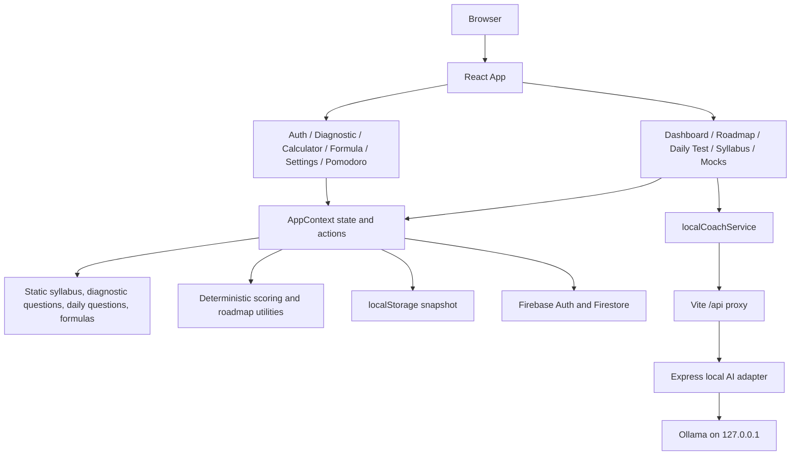

### Runtime boundaries

| Boundary | Responsibility | Source of truth |
|---|---|---|
| React views | Render screens and collect user actions | Context state |
| `AppContext` | Coordinate profile, progress, actions, and persistence | In-memory application state |
| Static data | Provide syllabus, formulas, and question content | Repository files |
| Scoring utilities | Calculate percentiles, mastery, roadmap, segments, briefings | Deterministic functions |
| `localStorage` | Preserve browser state between sessions | `cat_prep_45day_state_v1` |
| Firebase | Optional authenticated cloud persistence | Owner-scoped Firestore documents |
| Ollama adapter | Generate supplemental explanations only | Local model response; never answer key authority |

### Firestore data model

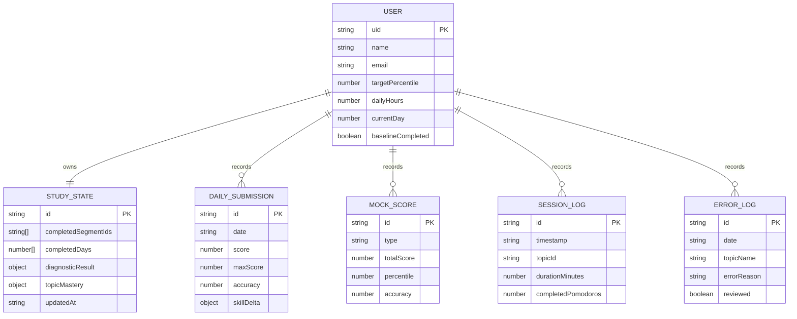

## Data and scoring model

### CAT sections

The application models the three CAT sections:

- **VARC:** Verbal Ability and Reading Comprehension.
- **DILR:** Data Interpretation and Logical Reasoning.
- **QA:** Quantitative Ability.

### Diagnostic model

The current diagnostic uses 18 repository-defined questions—six per section—with a 35-minute UI timer. Its score is computed locally with CAT-style `+3/-1` handling. The percentile display uses a fixed score-to-percentile table for orientation and planning.

### Daily-test model

Daily tests use six randomly selected questions from the combined in-repository question pools. The scheduled mode attempts roadmap-topic matching; the section mode filters by section. Each submission updates:

- Score.
- Accuracy.
- Topic mastery.
- Questions practiced.
- Cumulative accuracy.
- Error notebook.
- Roadmap completion for the current profile day.

### Roadmap model

The roadmap contains 45 days and three phases. It is generated from a static curriculum template with a limited set of weak-topic branches. It is personalized enough to prioritize known deficits, but it is not a learned recommendation system.

## Local open-weight model workflow

The project has no hosted model dependency. The optional coach uses an open-weight model running locally through [Ollama](https://ollama.com/).

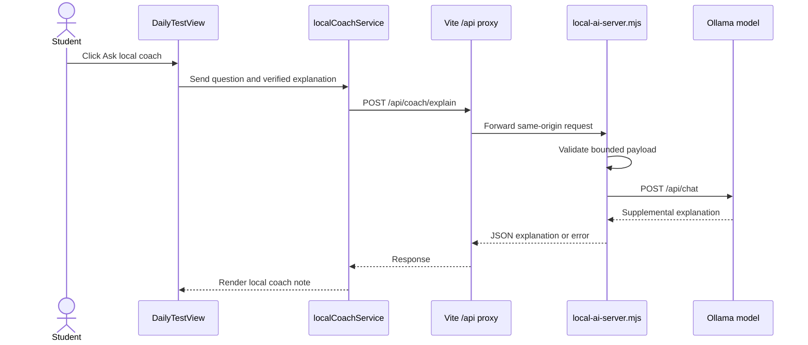

The request contains only the current question context:

- Question and optional passage.
- Answer choices.
- Student's selected answer.
- Verified correct answer.
- Repository explanation.
- Topic name.

The adapter:

- Binds to `127.0.0.1`.
- Defaults to port `8787`.
- Defaults to Ollama at `http://127.0.0.1:11434`.
- Defaults to `qwen2.5:7b`.
- Limits request size and field lengths.
- Uses a fixed system prompt that treats the verified solution as ground truth.
- Uses a non-streaming request with low temperature.
- Times out after 45 seconds.
- Returns clear `400`, `502`, or `503` errors.

This is intentionally a **local coach adapter**, not an autonomous agent framework. It has no tools, no database access, no ability to edit scores, and no agent loop. An open-source agent harness would become useful later if the product needs multi-step actions such as planning a week, querying a structured error database, or creating a study schedule with explicit user approval.

## Technology stack

- **Frontend:** React 19, TypeScript, Vite.
- **Styling:** Tailwind CSS through `@tailwindcss/vite`.
- **Icons and motion:** Lucide React, Motion, Canvas Confetti.
- **Persistence:** Browser `localStorage` and optional Firebase Auth/Firestore.
- **Local inference:** Ollama with an open-weight instruct model.
- **Local adapter:** Express and dotenv.
- **Package management:** npm or Bun-compatible lockfile workflow.

## Getting started

### Prerequisites

- Node.js 18+ recommended.
- npm.
- Ollama, only if you want the local coach.
- An Ollama-compatible instruct model, only if you want the local coach.

### 1. Install dependencies

```sh
npm install --legacy-peer-deps
```

The repository currently contains a Vite/esbuild peer-range mismatch that can cause npm's strict resolver to stop. `--legacy-peer-deps` installs the declared project versions without changing the application dependency declarations.

### 2. Configure the local adapter

```sh
cp .env.example .env
```

Default `.env` values:

```dotenv
OLLAMA_BASE_URL="http://127.0.0.1:11434"
OLLAMA_MODEL="qwen2.5:7b"
LOCAL_AI_PORT="8787"
APP_URL="http://localhost:3000"
```

The Ollama variables are read by the local Node adapter and are not embedded into the browser bundle.

### 3. Install and start an open-weight model

Install Ollama from [ollama.com](https://ollama.com/), then run:

```sh
ollama pull qwen2.5:7b
ollama serve
```

You can use another installed model by changing `OLLAMA_MODEL` in `.env`.

### 4. Start the local AI adapter

In terminal 1:

```sh
npm run dev:ai
```

Expected behavior:

```text
Local AI adapter listening at http://127.0.0.1:8787
Using Ollama model: qwen2.5:7b
```

### 5. Start the frontend

In terminal 2:

```sh
npm run dev
```

Open [http://localhost:3000](http://localhost:3000).

The frontend can run without Ollama or the adapter. Only the **Ask local coach** action requires both local services.

### 6. Try the product

For the quickest demonstration:

1. Open the app.
2. Choose a demo profile or create a manual profile.
3. Open the diagnostic assessment.
4. Submit the diagnostic and inspect weak topics.
5. Open **Roadmap** and select a day.
6. Open **Daily Test** and launch a scheduled drill or section sprint.
7. Submit the six questions.
8. Review score, skill deltas, verified explanations, and error entries.
9. Try **Ask local coach** on one result if Ollama is running.
10. Start a Pomodoro session from a daily-study segment.
11. Add an external mock score in **Mock Tracker**.

### Useful commands

```sh
npm run dev:ai  # Start the local Ollama adapter
npm run dev     # Start the Vite development server
npm run lint    # TypeScript validation
npm run build   # Production frontend build
npm run preview # Preview the built frontend; /api needs a separate deployment proxy
```

## Project structure

```text
.
├── server/
│   └── local-ai-server.mjs       # Loopback Express adapter for Ollama
├── src/
│   ├── components/               # Screens, modals, tools, and dashboard widgets
│   ├── context/
│   │   └── AppContext.tsx        # Central state, actions, persistence, and sync
│   ├── data/                     # Static syllabus, questions, and formulas
│   ├── lib/
│   │   └── firebase.ts           # Firebase initialization and error helpers
│   ├── services/
│   │   ├── firebaseService.ts    # Firestore persistence operations
│   │   └── localCoachService.ts  # Browser contract for local AI explanations
│   ├── utils/
│   │   └── catScoring.ts         # Percentiles, mastery, roadmap, briefings, segments
│   ├── App.tsx                   # Application shell and tab rendering
│   ├── index.css                 # Global styling
│   └── types.ts                  # Shared domain types
├── .env.example                  # Local adapter configuration template
├── firebase-applet-config.json   # Firebase app configuration used by the client
├── firestore.rules               # Owner-scoped Firestore rules
├── metadata.json                  # App metadata
├── package.json                  # Scripts and dependencies
├── tsconfig.json                 # TypeScript configuration
└── vite.config.ts                # Vite and development API proxy
```

## Persistence, privacy, and security

### Browser-local state

The app stores a state snapshot under `cat_prep_45day_state_v1`. It includes the profile, syllabus progress, diagnostic result, roadmap completion, mock records, daily submissions, error log, completed segments, and study sessions.

This gives the app useful local resilience, but it is browser-scoped. Clearing site data, using another browser, or switching devices does not automatically transfer the local state.

### Firebase cloud sync

Google-authenticated users can sync owner-scoped data to Firestore:

- User profile.
- Central study state.
- Daily submissions.
- Mock scores.
- Pomodoro session logs.
- Error logs.

The Firestore rules are designed around `users/{uid}` ownership and nested user collections. Firebase errors are caught and logged so a temporary cloud failure does not prevent the local UI from being used.

### Local AI privacy boundary

The local coach sends the current question context to the local adapter and then to Ollama on loopback. It does not need a cloud API key. The adapter does not write to Firebase, does not receive the full profile, and does not have tools for modifying application state.

Do not place sensitive personal information in question text or prompts. Treat any future user-entered notes as untrusted model input.

## Current scope and limitations

This project is intentionally honest about what is implemented today:

- The percentile calculation is a fixed educational estimate, not an official CAT prediction or normalization service.
- Diagnostic and daily-test questions come from static repository data.
- Daily Test samples six questions; it is not a full CAT exam engine.
- The Mock Tracker records scores from external tests; it does not generate or proctor full mocks.
- The roadmap is a rules-based 45-day template with limited weak-topic branching.
- The local coach is supplemental and may be unavailable, slow, or imperfect.
- The verified repository explanation remains more authoritative than model output.
- Reminder settings do not send browser, email, SMS, or push notifications.
- The current-day/streak experience includes seeded/profile state and does not yet provide a complete historical streak engine.
- Local and cloud state do not currently have a conflict-resolution or merge strategy.
- The development Vite proxy is not a production reverse proxy. A deployed local-coach setup needs an equivalent server route.
- The current application is a single-page conditional-rendering app, not a route-based multi-page application.

## Future scope

### Near-term product improvements

1. **Compressible 40-day mode**
   - Let the learner enter exact days remaining.
   - Recalculate the roadmap into 40, 30, or 20-day modes.
   - Preserve mandatory diagnostic, revision, and mock-analysis checkpoints.

2. **Stronger adaptive planning**
   - Reweight days using weak topics, strong topics, recency, confidence, time availability, and mock trends.
   - Recommend the next best segment instead of only generating a fixed roadmap.
   - Add explicit spaced repetition for recurring mistakes.

3. **A complete error-analysis workspace**
   - Add manual error creation.
   - Support categories such as conceptual gap, calculation mistake, misread, time pressure, and question selection.
   - Show recurring-error trends and topic-level remediation plans.

4. **Measured practice timing**
   - Track per-question time, section timing, review time, and abandonment behavior.
   - Replace the current daily-test fallback duration with measured elapsed time.

5. **Real mock and sectional engine**
   - Add timed full-length simulations.
   - Support MCQ and TITA input paths.
   - Add review marking, section locking, question navigation, and post-mock analysis.

### Learning and accessibility improvements

6. **Personalized explanations**
   - Let the learner ask for a simpler explanation, a visual analogy, a faster method, or another solved example.
   - Add citations to the repository's verified explanation where applicable.
   - Add an explicit “report explanation” action.

7. **Accessibility and language support**
   - Improve keyboard navigation and screen-reader labels.
   - Add readable contrast and reduced-motion preferences.
   - Explore bilingual explanations for learners more comfortable with regional languages.

8. **Low-bandwidth and offline package**
   - Cache static content as a proper installable PWA.
   - Add offline question sessions and deferred sync.
   - Provide export/import of progress for device migration.

### Infrastructure and model improvements

9. **Production-safe local-model gateway**
   - Add authentication, origin restrictions, rate limiting, structured logs, and deployment-specific reverse proxying.
   - Support Ollama, llama.cpp, and other OpenAI-compatible local servers behind the same interface.

10. **Human-approved agent workflows**
    - Consider an open-source agent harness only for explicit multi-step tasks.
    - Example: “Use my last three mock reports and error log to draft next week's plan.”
    - Require a preview and learner approval before changing roadmap state.
    - Keep scoring and answer verification outside the agent.

11. **Privacy-preserving analytics**
    - Add opt-in, anonymized learning analytics.
    - Measure which interventions improve consistency without collecting unnecessary personal data.

### Longer-term social and educational opportunities

12. **Mentor and peer support**
    - Let a mentor review a learner's progress with permission.
    - Create study circles with shared goals but private scores by default.

13. **Open educational content**
    - Build a reviewed, versioned library of explanations and practice sets.
    - Attach provenance and difficulty calibration to each question.

14. **Scholarship and access programs**
    - Partner with student communities to provide low-cost preparation infrastructure.
    - Offer curated plans for learners without paid coaching subscriptions.

## Social impact

### Immediate impact for the motivating learner

For a worried aspirant with 40 days left, the most immediate benefit is psychological and practical: the app replaces an overwhelming question—“Can I crack CAT?”—with a smaller sequence of actions:

1. Take a baseline.
2. Identify the biggest gaps.
3. Complete today's segments.
4. Attempt six focused questions.
5. Review mistakes.
6. Return tomorrow with evidence rather than guesswork.

This does not remove exam pressure, but it can reduce the uncertainty that makes pressure harder to manage.

### Broader educational impact

A tool like this can contribute to more equitable preparation by:

- Making a structured study workflow available without requiring a large coaching platform.
- Supporting self-directed learners who cannot afford one-to-one mentoring.
- Encouraging practice analysis instead of passive content consumption.
- Turning mistakes into reusable learning material.
- Supporting local inference for learners who prefer not to send study content to a cloud AI provider.
- Making progress portable through local state and optional cloud sync.

### Responsible impact principles

The project should not create a false promise that technology alone guarantees admission. Responsible use means:

- Showing estimates as estimates.
- Keeping the learner in control of the plan.
- Avoiding manipulative streaks or shame-based messaging.
- Protecting personal information and study history.
- Providing accessible alternatives when the model or network is unavailable.
- Reviewing educational content for correctness.
- Treating CAT as one opportunity, not a measure of a person's worth.

## Contributing

Contributions are welcome, especially in the areas of verified CAT content, accessibility, adaptive scheduling, error analysis, and offline support.

A useful contribution should include:

1. A clear description of the learner problem it solves.
2. A note about whether it changes deterministic scoring or answer-key behavior.
3. Validation through `npm run lint` and `npm run build` where applicable.
4. Updated documentation for new workflows or configuration.
5. No secrets, API keys, private learner data, or unreviewed answer keys.

For local model work, keep the model adapter narrow and auditable. Do not grant a model direct permission to mutate scores, Firestore records, or roadmap state.

## License and disclaimer

This repository is a personal educational project and should be reviewed for an explicit license before redistribution.

The application is a study-planning and practice aid. Percentiles, topic weightages, schedules, explanations, and recommendations are illustrative and may require independent verification against official CAT information and the learner's chosen preparation resources. It does not guarantee a CAT score, percentile, admission, or result.
